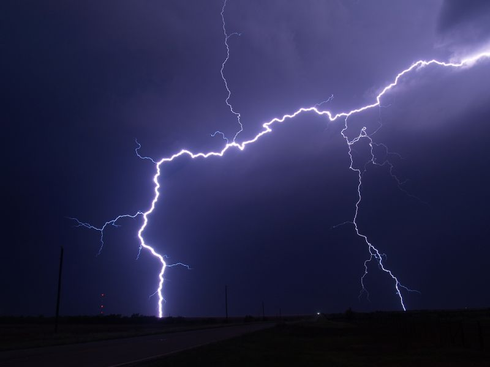

# FT4 Weather Vanilla JS Demos

## Demonstrating using vanilla JS to show weather for a given location

### Used the browser geo location api

This project _containes_ multiple stages of the development of the **final product.**

> A student said it was cool

Todo:

1. Make fully functional
2. Add more defensive checks
3. Add commentds

- Check spelling
- Tidy interface

`console.log("Hello World")`

---

[Open Weather Map] (https://openweathermap.org)



# May or may not work

| Name | Age |
| ---- | --- |
| Russell | 40 |
| Sally | 100 |

This function updated the DOM

```
clearWeather = () => {
    this.root.innerHTML = ``;
  };
```

This relates to this [^1]

Holiday
: A place you go to

~~ Fix HTML ~~

- [x] Check spelling
- [ ] Tidy interface

:)

:joy:

This is ==very important==

h~2~0

x^2^

[^1]: Some more data